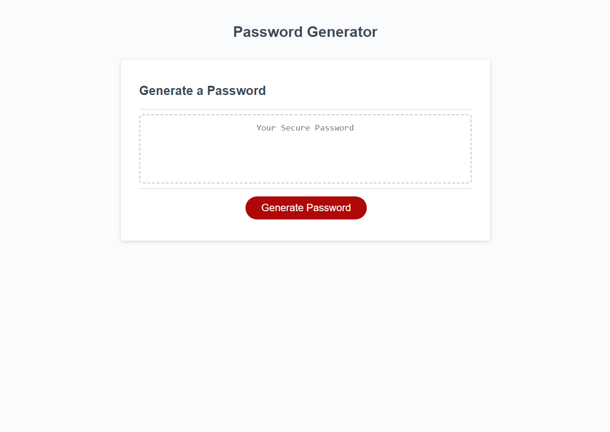
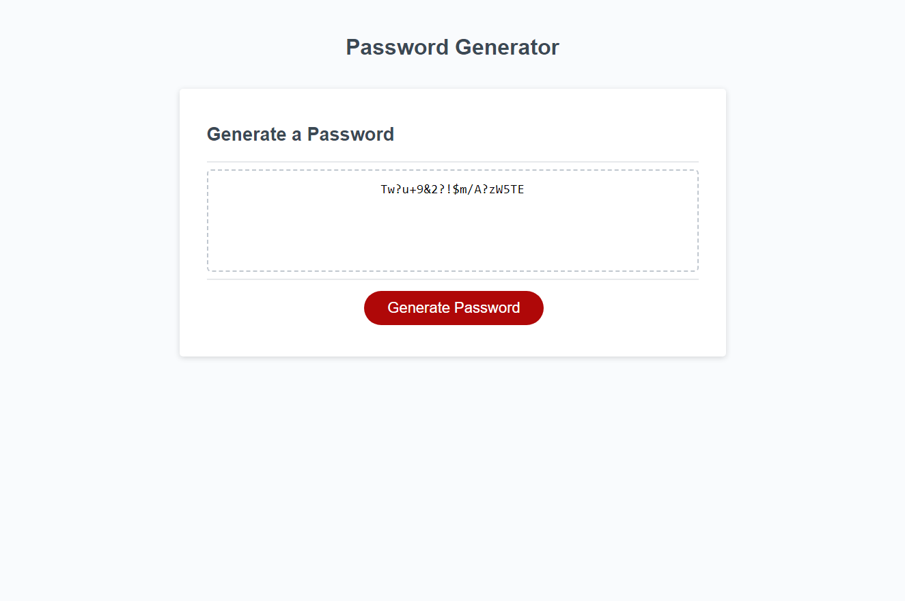

# Random Password Generator

## Description
This project is a random password generator that will give you a random password based off your selections. The password will be between 8 to 128 characters and you have the option to include uppercase letters, lowercase letters, numbers, and special characters. This project is useful for anyone that needs to set a temporary password or needs a more secure password.

## Usage/Examples

To use this webpage, simply click the "Generate Password" button. You will be prompted to enter the desired length of your password. Once selected you will be asked if you would like to include capital letters, lowercase letters, numbers and/or special characters in your password. Once you have made your selections, a random password will be generated.

## Screenshots

## 🔗 Project-Links

- [Deployed Applocation](N/A)
- [GitHub Repo](https://github.com/jeaustins27/Random-Password-Generator)

## Credits

- [W3 Schools](https://www.w3schools.com/)
- [ReadME.so](https://readme.so)
- [OWASP Special Characters](https://owasp.org/www-community/password-special-characters)

## License

[MIT](https://choosealicense.com/licenses/mit/)

